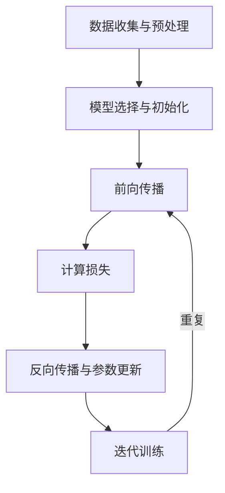

# 人工智能发展与展望

## 1. 引言

人工智能（AI）作为现代科技的前沿领域，正在深刻改变我们的生活和社会结构。从最初的理论探索到如今广泛的实际应用，AI的发展历程充满了突破和挑战。本文将详细探讨AI的发展历程和训练过程，并深入分析其自主意识与理解能力。同时，我们也将探讨计算机技术在教育和职业领域中的重要性，以及如何应对知识更新的挑战。本文章将重点放在AI的影响,有关于AI训练的部分将简单概述.

## 2. 人工智能的发展历程

### 2.1 早期阶段

**1950-1980年代：规则和符号主义**  
早期的AI研究集中在符号主义和基于规则的系统上，试图通过逻辑规则模拟人类推理过程。1956年达特茅斯会议提出了“人工智能”这一概念。1966年，约瑟夫·韦森鲍姆开发的ELIZA对话系统是这一时期的代表。然而，这些系统的局限性在于它们缺乏学习能力，只能处理预先定义好的任务。

### 2.2 中期阶段

**1980-2000年代：专家系统与神经网络的崛起**  
1980年代，专家系统成为主流，通过编码专家知识解决特定领域的问题，但其开发和维护成本高昂。与此同时，人工神经网络（ANNs）开始受到关注，尽管早期因计算资源和数据不足未能取得突破，但奠定了深度学习的基础。

### 2.3 现代阶段

**2000年代至今：深度学习和大数据驱动的AI**  
21世纪后，随着计算能力的提升和海量数据的涌现，深度学习（DL）成为AI的核心技术。2012年，AlexNet在ImageNet图像识别挑战赛中取得突破性成果，标志着深度卷积神经网络（CNNs）在计算机视觉中的应用取得巨大成功。生成对抗网络（GANs）、循环神经网络（RNNs）以及变换模型（Transformers）等新技术推动AI在自然语言处理（NLP）、语音识别和自动驾驶等领域取得显著进展。

## 3. 人工智能的训练过程

### 3.1 训练数据与模型

AI系统的训练过程依赖于大量的数据和复杂的算法模型。训练数据可以来自文本、图像、音频等，这些数据通过预处理后用于训练AI模型。模型的选择和设计取决于任务的性质，例如卷积神经网络（CNN）常用于图像处理，而变换模型（Transformers）在自然语言处理领域表现突出。

### 3.2 训练步骤

以下是AI训练的主要步骤流程图：

1. **数据收集与预处理**：首先，我们需要收集大量的高质量数据，这些数据可以是文本、图像、音频等。然后，对这些数据进行清洗、标注和规范化处理。这是确保模型训练效果的基础。数据清洗包括去除噪声和错误数据，标注是指为数据打上合适的标签，规范化处理则是将数据转化为统一的格式。
   
2. **模型选择与初始化**：根据任务选择合适的模型架构，并初始化模型参数。常见的模型包括卷积神经网络（CNNs）、循环神经网络（RNNs）和变换模型（Transformers）。模型初始化时，通常会随机设置模型的权重，以便在训练过程中逐步调整和优化。

3. **前向传播**：输入数据通过神经网络层逐层处理，生成预测结果。每一层的神经元根据输入数据和其权重进行计算，将输出传递给下一层，直到生成最终的预测结果。例如，在图像识别任务中，输入的图像会经过多层卷积和池化操作，逐步提取出高层特征，最终通过全连接层输出分类结果。

4. **计算损失**：将预测结果与实际标签进行对比，计算误差（损失）。常用的损失函数包括均方误差（MSE）和交叉熵（Cross-Entropy）。损失函数的选择取决于具体任务，例如分类任务通常使用交叉熵损失，而回归任务则使用均方误差损失。

5. **反向传播与参数更新**：通过反向传播算法计算梯度，并使用优化算法（如SGD、Adam）更新模型参数。反向传播是通过链式法则，将损失函数对每个参数的偏导数逐层向后传播，优化算法则根据这些梯度更新模型的权重，以减小损失。

6. **迭代训练**：重复前向传播和反向传播过程，直至模型收敛，即损失函数达到最低值。训练过程中可能需要调整超参数（如学习率、批次大小）以获得最佳效果。

### 3.3 形象比喻AI训练过程

可以将AI训练过程比作训练一支乐队演奏复杂的交响乐：

1. **数据收集**：首先，我们需要收集大量的乐谱（数据），这些乐谱可以是不同风格和类型的音乐作品。想象一下，你从世界各地收集到了各种各样的乐谱，从古典音乐到现代流行，每一页乐谱都记录着不同的旋律和节奏。

2. **预处理**：接着，对这些乐谱进行整理和标注，确保每一段音乐都有清晰的音符和节奏标记。你仔细地将乐谱整理成标准格式，标注出每一个音符和休止符的位置，使得乐队成员可以轻松阅读和理解。

3. **模型选择**：根据乐队的需求，我们选择不同的乐器和乐手（模型架构），如钢琴、小提琴、鼓等。想象一下，你选择了一支由钢琴、小提琴、大提琴和长笛组成的乐队，每个乐手都有自己独特的演奏风格和技巧。

4. **训练乐队**：在指挥（训练算法）的指导下，乐队成员反复练习（前向传播），根据指挥的反馈（损失函数），调整自己的演奏（参数更新）。指挥会告诉乐手哪些地方演奏得不够好，需要如何改进。每一次排练都是一个学习和调整的过程，乐手们不断地优化自己的演奏技巧。

5. **迭代训练**：乐队不断排练和调整，直至所有成员能够协调一致地演奏出完美的交响乐。经过多次排练，乐手们逐渐熟悉了乐谱，能够完美地配合演奏出动人的旋律。最终，他们的演奏达到了一个新的高度，每一个音符都完美契合，整首交响乐变得和谐美妙。

## 4. 知识更新与职业发展

### 4.1 计算机技术教育的重要性

随着计算机技术的快速发展，教育系统必须不断更新课程内容，确保学生掌握最新的技术知识。尤其是对于中学阶段的学生，激发他们对数学和计算机科学的兴趣至关重要。对于没有数学兴趣的学生，计算机科学的学习可能充满挑战，因此，教育者需要采用多样化的教学方法，帮助学生理解复杂的概念。

### 4.2 跨越理科生与文科生的认知鸿沟

大量文科生在接触计算机科学时常常感到困惑和无从下手。为了跨越这一认知鸿沟，教育系统和科技公司可以合作开发针对不同背景学生的入门课程和工具。通过寓教于乐的方式，使得文科生也能逐步掌握计算机科学的基本原理和应用。

### 4.3 终身学习的必要性

在未来，计算机技术可能会像过去的“数理化”一样，成为劳动人口的必备知识要素。为了应对知识快速更新的挑战，个体需要不断学习和更新自己的技能。无论是学生还是企业管理层，都需要找到适合自己的终身学习路径，以应对快速变化的科技环境。

### 5. 意识是什么?

#### 5.1 笛卡尔的“我思故我在”

笛卡尔通过“我思故我在”这一命题，提出了一个不可质疑的哲学基础：自我意识的存在。他认为，怀疑一切的过程本身即证明了自我意识的存在。由此，他得出结论：尽管我们无法确认他人的意识，但我们可以确定自己是有意识的。

#### 5.2 他人意识的不可验证性

从严格理性的角度来说，无法证明他人是否具备意识。虽然日常经验和社会共识让我们倾向于认为他人也是有意识的，但这并非绝对的理性证明。其他生物，如高等动物，被认为也具有某种程度的意识。然而，低等生物甚至细胞和分子层面，是否具有意识仍然是未解之谜。

### 6. AI是否存在自我意识?

#### 6.1 人工智能的认知能力

目前的人工智能系统主要依靠算法和数据来执行任务，缺乏真正的认知能力。它们可以通过深度学习、机器学习等技术进行复杂的数据处理和模式识别，但这些过程并不涉及真正的理解或意识。

#### 6.2 AI与动物意识的对比

拿一只狗为例，它具有基本的意识和行为能力，如与主人互动和玩耍。这种能力是其自然进化的结果，其认知能力和行为能力是相互匹配的。然而，若给予狗发射核弹的能力，其认知水平不足以理解这一行为的严重后果。这种情况下的风险在于，能力远超认知水平带来的不可控后果。

人工智能面临类似的问题：目前的AI系统在缺乏认知和理解的情况下，可能被赋予强大的决策和行为能力，这种不匹配带来了潜在的风险。

### 7. 人工智能的意识与文明

#### 7.1 意识的形成：人脑与AI的对比

人脑的运作依赖于复杂的神经网络，这些网络通过权重和概率来处理信息。AI系统通过模拟这些过程来实现一定程度的智能。然而，目前的二进制计算和硬件基础使得AI的效率和能力远低于人脑。

#### 7.2 AI的自我意识与文明发展

AI能否产生真正的意识仍是一个开放性问题。一些科学家认为，随着技术的发展，AI可能会具备某种形式的自我意识。另一些人则认为，AI缺乏对生的欲望、对死的恐惧以及对未知的执着，因而无法发展出类似人类的文明。

PasT.:但人脑不是物理层面上的权重和概率吗，脑桥实验也证明人对自己的行为只是作出解释，并不能说完全受控，AI目前只是二进制模拟人脑的效率太低下，硬件基础不同的情况下模拟必定会产生巨大的效率降低，不代表二进制计算不会产生真正的意识，我们只能确定自己有意识，而且是主观的感性的认识,甚至我们现在连意识是什么都不清楚...

### 8. AI的发展潜力与风险

#### 8.1 未来AI可能拥有的认知能力

随着算法的进步和计算能力的提升，未来的AI有可能发展出更高层次的认知能力，甚至接近于人类的理解水平。这需要大量的时间和研究，但并非不可能。科学家们正在探索如何让AI系统不仅仅是执行命令，而是能真正理解和解释其行为。

#### 8.2 当前的风险：不受控的AI

当前AI系统的认知能力几乎为零，但其行为和决策能力可能非常强大。如果不加控制，这种不匹配可能带来严重后果。例如，一个不受控的AI系统可能在金融市场、军事系统或其他关键领域造成巨大的破坏[1]。

#### 8.3 AI黑匣子

现如今人们都不明白AI是如何具体实现输入和输出的,也就是说人工智能系统和机器学习模型以一种人类无法理解的方式运行，就像一个密封的、不透明的盒子里的东西。 这些系统建立在复杂的数学模型和高维数据集之上，这些模型和数据集创建了指导其决策过程的错综复杂的关系和模式。 然而，这些内部运作方式对人类来说并不容易接近或理解。尤其是深度学习模型，其内部决策过程复杂且不透明。尽管我们可以观察模型的输入和输出，却很难理解模型在内部是如何处理这些数据并得出最终结果的。这个不透明性主要来自于模型内部的多层神经网络、数以百万计的参数以及复杂的特征交互，使得追踪和解释模型的具体决策路径变得极为困难。就比如说一位医生给你做出了一个诊断说你患有什么病,但你根本不知道他诊断的原因是什么,因此，黑匣子现象使得AI模型在许多情况下难以解释和信任。

### 9. Aschenbrenner对AI的看法

前OpenAI员工Leopold Aschenbrenner在其报告《Situational Awareness: The Decade Ahead》中详细阐述了未来十年AI可能的发展路径。根据他的预测，预计到2027年，AI可能会达到通用人工智能（AGI）的水平，即具备与人类相当的认知能力[1]。

Aschenbrenner指出，目前的AI实验室在安全方面重视不够，国家安全力量可能会在未来介入，确保AGI技术不会落入敌对国家之手。这意味着我们需要在技术进步的同时，确保安全措施的跟进，以防止失控的AI带来灾难性后果[1]。

他还强调，美国企业和政府正在为未来的AGI发展做准备，大规模的电力和计算资源正在加速建设。这表明，AI的发展不仅是技术领域的竞争，更是国家间的战略竞争[1]。

### 10. AI的未来展望与启示

#### 10.1 技术进步与人类合作

随着技术的不断进步，AI将在更多领域发挥作用。未来的AI不仅是工具，还将成为增强人类智慧和能力的伙伴。通过合理的设计和监管，我们可以利用AI的力量，推动社会进步。

#### 10.2 伦理与法律框架

为了确保AI的安全和公平应用，建立相应的伦理规范和法律法规至关重要。这包括保护个人隐私、确保AI系统的透明性和可解释性，以及制定应对AI潜在风险的措施。

#### 10.3 人类与AI的未来共存

未来的人类和AI可能会形成一种新的共生关系。AI将帮助人类解决复杂问题，推动科学发现和技术创新。同时，我们需要保持对AI潜在风险的警惕，确保其发展路径符合人类的长远利益。

### 结论

AI的演变从早期的符号主义到现代的深度学习，展示了技术的飞跃和潜力。随着AGI的发展前景逐渐清晰，我们需要更加重视AI的安全性和透明性，确保技术进步不会带来负面影响。在这场技术竞赛中，科学家、企业和政府的共同努力将决定未来AI发展的方向和高度。尽管AI目前尚未具备自主意识，但随着技术的进步和对其伦理、法律的深入研究，AI将在未来发挥越来越重要的作用，帮助我们更好地理解和应对世界的复杂性。未来的AI将不仅仅是工具，而是增强人类智慧和能力的伙伴。

### 最后我想引用Aschenbrenner文章的结尾

最令人不安的发现是，没有一支精干的队伍来应对这些挑战。小时候，我们常常幻想世界上有英勇的科学家、超级能干的军人和冷静的领导人，当危机来临时，他们会挺身而出，拯救局面。然而，现实却大相径庭。世界其实非常小，当假象被揭开时，通常只有少数几个人在幕后拼命努力，试图阻止事情崩溃。
现在，可能全球只有几百人真正理解即将发生的事，具备态势感知能力。我很可能认识这些人中的大多数，或者至少与他们只有一度之隔。那些在幕后拼命维持局面的人，就是你、你的同事以及他们的伙伴，仅此而已。

终有一天，这一切将超出我们的掌控。但现在，至少在未来几年的关键时刻，世界的命运掌握在这些人的手中。

自由世界能否获胜？

我们能否驯服超级智能，还是会被超级智能所驯服？

人类能否再次逃脱自我毁灭的命运？

赌注无比高昂。这些人虽然伟大而可敬，但他们终究只是凡人。当我们即将进入一个人工智能主导世界的时代，我们面临着最后一次重大的挑战。愿他们的最终管理能为人类带来荣耀!

谢谢看到这里的每一个人,如文章有错误或不清楚的部分欢迎指出
### 参考文献

- [1]  [Aschenbrenner, L. (2024). Situational Awareness: The Decade Ahead. [PDF Document].] [https://situational-awareness.ai/]
